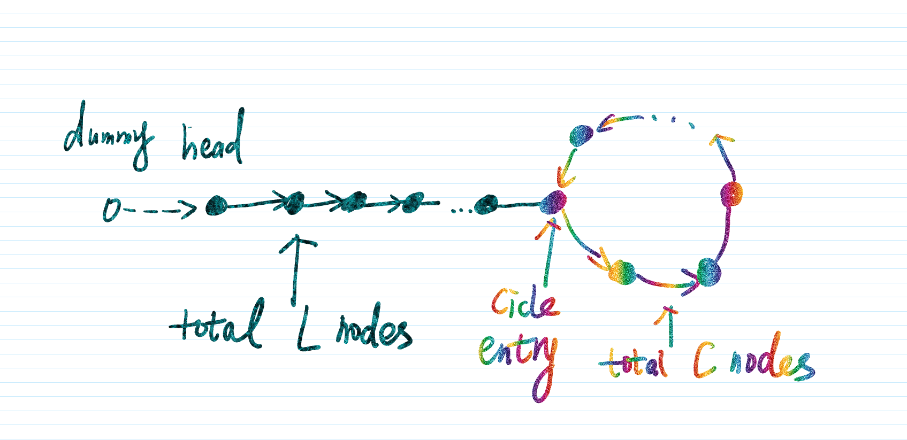

　　今天记录的是两道特别有意思的题：判断链表中存不存在环(circle)。为了找解法，在纸上画了各种数字、箭头、圈圈和推导，还以为在研究什么彩票号码呢哈哈 ~ ~ ~

## 题目描述

　　和昨天一样，今天的两道题同样是分为基础版和进阶版，不同的是，今天的两个版本可以看作是一道大题的两小问，二者关联性更强。

>　　基础版：
> 　　
> 　　　　判断链表是否存在环。([141. Linked list cycle](https://leetcode.com/problems/linked-list-cycle/description//))
> 　
>　　进阶版：
>　　
>　　　　若存在环，找出环的起点。([142. Linked list cycle II](https://leetcode.com/problems/linked-list-cycle-ii/description/))　　 　 　

　　另外，要求在不修改链表的同时，空间复杂度为$O(1)$。

## 解题思路

### 基础版

　　这道题我一开始是联想到了之前学习DFS的思路，即遍历每个节点，并在访问后做上visited的标记，如果访问到一个已经标记的节点，说明有环。然而想法是美好的，不，也并不美好，毕竟这个空间复杂度不是$O(1)$，而且发现没那么好实现，因为单向链表的特点就是不能回头，你很容易知道一个节点的下一个节点是啥，但前一个节点是啥？不能直接知道。

　　后来逛了下别人的答案，感觉自己被羞辱了，思路完全不一样啊！完全没这么想啊！看来还是经验不够啊！(受打击三连)又学习到了。具体怎么做呢？需要用到两个指针，一个每次走一步(slow)，另一个走得快一点，每次走两步(fast)，咳咳，重点来了 ~ 如果一个链表不存在环，那总会走向终点(遇到Null)；如果存在环呢？那两个指针会一直走下去，但这样循环没法终止，就没法返回结果，所以进一步的判断依据是，如果存在环，slow和fast两个指针会相遇，一旦相遇，循环终止，即可返回结果。代码如下：

```python
def hasCycle(head):
        """
        :type head: ListNode
        :rtype: bool
        """
        slow, fast = head, head
        while fast and fast.next:
            slow = slow.next
            fast = fast.next.next
            if slow==fast:
                return True
        return False
```

### 进阶版

　　虽然有了基础版的打底，但进阶版也折腾了我很久，最后还是借了别人的智慧才解决的，唉，心塞。 和基础版一样，我们需要设置两个指针，均初始化为head(如果有的话)，因为没有环的情况很好判断，我们接下来只讨论在有环的情况下，如何找环的起始点。

　　将head看作第一个节点，为了方便表述，我们添加一个指向`head`的`dummy`节点，那么`dummy`可以看作第0个节点。另外，我们将链表分为线状和条状的两部分，如下图所示，线状节点个数为$L$, 环内节点个数为$C$。





若从第0个节点出发，前进$ m $步，到达第$n$个节点($0<n<(L+C-1)$,则有：

$$
n=\left\{
\begin{array}{lrc}
n, (n\le L) &\\
L+(n-L)\% C,& (n>L) 
\end{array}
\right.
$$


　　我们让`slow`和`fast`两个指针同时从`dummy`出发。当二者第一次相遇(meet)时，`slow`和`fast`分别走了$T$和$2T$步，那么二者相差的步数$T$肯定是环内节点数$C$的整数倍，即$T=iC,(i是正整数)$。我们设它们相遇在第$M$个节点，由于肯定在环内相遇，我们可以假设$M=L+x$,其中$x$为环内的那段。则有：
$$
\begin{aligned}
&T = L+x+jC\\
&2T - T = iC
\end{aligned}
$$
因此$M=L+x$也必定是环节点数$C$的正整数倍
$$
L+x=(i-j)C=kC
$$
　　特殊情况下，$L=0$，即`head`即为环的入口，这种情况下，`slow`和`fast`必然相遇在环的入口，也就是`head`处，此时我们直接返回`head`即可。

　　若$L\ne0$: 我们再设一个指针`_head`，初始为`dummy`,那么此时`slow`(或者`fast`,因为循环终止条件是二者相同)与`_head`的距离为$L+x=kC$。此时再分两种情况讨论。让`slow`和`_head`以相同的步数同时出发，可知，如果二者可以相遇，那么必定在**环的入口**。原因是：

> 一旦二者都在环内，且由于二者具有相同的速度，那么它们肯定不会相遇。

　　下面我们证明二者相遇的必然性。假设`_head`和`slow`均前进了`m`步，且$m>L$，则二者所在的节点数分别为：

`_head`: 根据
$$
L+(m-L)\%C, L+x=kC
$$
`_head`的位置：
$$
\begin{aligned}
pos &= L + (m-kC+x)\%C\\
&= L + (m + x) \% C
\end{aligned}
$$
`slow`: 其初始位置为$L+x$, 前进了$m$步， 其最终位置：
$$
pos = L+(m+L+x-L)\%C\\
=L+(m+x)\%C
$$


　　由于只要保证相同的出发点，`slow`和`fast`之间的相对距离是不变的，在实际代码实现的时候，我们可以不必设置`dummy`，让二者之间初始化为`head`，使二者都从`head`出发，同样可以得出 结果。代码如下：

```python
def detectCycle(head):
        """
        :type head: ListNode
        :rtype: ListNode
        """
        if not head:
            return None
        slow, fast = head, head
        
        while fast and fast.next:
            slow = slow.next
            fast = fast.next.next
            
            if slow == fast:
                break
        
        if not fast or not fast.next:
            return None
        
        if head == slow:
            return head
        _head = head
        while _head != slow:
            _head = _head.next
            slow = slow.next
        return _head
```

## 总结

　　刷完链表就刷树和图吧，数据结构太有意思了。记得之前我关注的一个博主曾在合理使用堆栈给出某道题很elegant的解法时感慨：“啊，这就是数据结构的胜利！！！”而我目前还只是在练习一些很简单的操作，希望我以后也能将它们变为趁手的利刃吧。