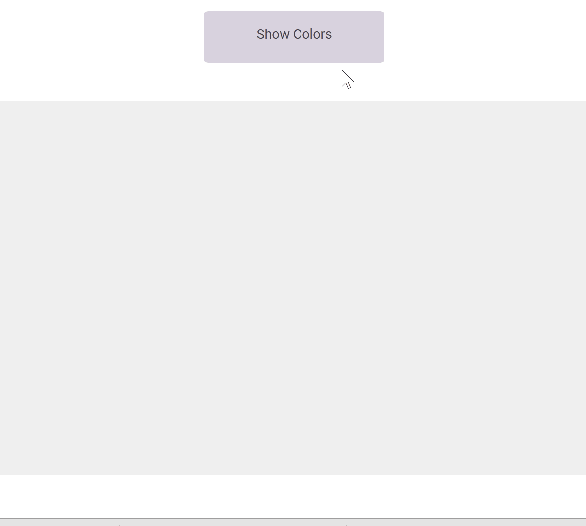

　　这两天学习写了2048的网页版，由于我想自定义2048每个数字小方块的颜色，然后想写个网页展示展示，折腾了一番，最后结果如下：



<!--more-->

下面是灰常简单的代码\~

- `html`文件
```html
<!DOCTYPE html>

<!DOCTYPE html>
<html>
<head>
    <title>COLOR PALLATTE</title>
    <link rel="stylesheet" type="text/css" href="colors.css">
    <script type="text/javascript" src="color_style.js"></script>
    <script type="text/javascript" src="jquery.min.js"></script>
</head>
<body>
    <header>
        <h1>COLOR PALLATTE</h1>
        <a href="javascript:add_colors();" id="show_button">Show Colors</a>
    </header>

    <div id="container"></div>

</body>
</html>
```

- `css`样式：

```css
header {
    text-align: center;
    display: block;

    text-align: center;
}
header h1{
    font-family: Arial;
    font-size: 60px;
    font-weight: bold;
    background-color: #9AA5A4;
    color: #005149;
    margin: 0 auto;

}

header #show_button {
    font-family: Roboto;
    font-size: 18px;
    margin: 0 auto;
    display: block;
    width: 200px;
    height: 30px;
    padding: 20px 20px;
    border-radius: 5%;
    background-color: #D8D2DE;
    color: #47444B;
    text-decoration: none;
    position: relative;
    top: 50px;
}

#container {
    display: grid;
    grid-template: repeat(4,100px)/repeat(4,100px);
    grid-gap: 20px 20px;
    width: 480px;
    height: 480px;
    margin: 100px auto;
    padding: 20px;
    background-color: #EFEFEF;
    /*position: relative;*/
    justify-content: center;
    
    
}

.cell {
    width: 100px;
    height: 100px;  
    position: relative; 
}
```
- `.js`文件


```js

var colors1_dic={1:'#FCEAEE',2:'#C697A1',3:'#F6B9AB',
4:'#C2B3D1',5:'#00AC97',6:'#648C87',7:'#FFF9A9',
8:'#969145',9:'#BDDFA4',10:'#3D7019',
11:'#0EEAD0',12:'#FF3D11',13:'#F9EE48',14: '#C2B9CC', 15:'#A39C65',16:'#8EA87C'};

var box_size=100;
var space=20;

function add_colors() {
    //$('.cell').remove();
    var k=1;
    for(var i=0;i<4;i++){
        for(var j=0;j<4;j++){
            $('#container').append('<div class="cell" id="color_' + k + '"></div>');
            var color_num=$('#color_'+k);

            color_num.css('width','100px');
            color_num.css('height','100px');
            color_num.css('grid-area',get_area(i,j));
            color_num.css('background-color',colors1_dic[k]);
            ++k;
        }
    }
}


function get_area(i,j){
    return (i+1)+'/'+(j+1)+'/'+(i+2)+'/'+(j+2);
}
```

　　　但我目前学习的jQuery的知识好像没有涉及到grid的动画，所以本来想用grid来实现对2048里面每个小方块的操作，现在估计要多学习学习再看啦。
